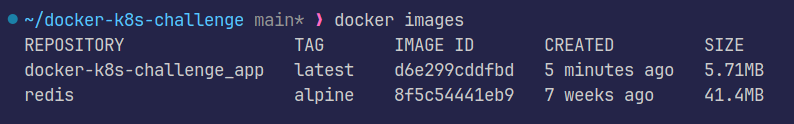
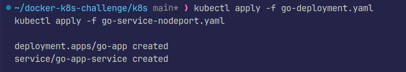

# DevOps Challenge: Fix &amp; Deploy Go App with Redis

## Overview

- My task is to troubleshoot, fix, and deploy a Go web application that uses Redis for caching. There are some issues in the Dockerfile or the Go code. After fixing these issues, the app is to be deployed to a Kubernetes cluster with Redis.

## Part 1: Fix the Dockerfile and Go Application

- Fixed bug in `CMD ["bin/myapp"]` to `CMD ["app/myapp"]`
- Changed PORT to 8080 to ensure clarity
- Set up a Redis container using docker-compose and passed its environment variables
- Optimized image size using multistage builds by using `debian:bookworm-slim`, effectively reducing image size from 1.03GB to 83.2MB (~92% size reduction!!!)
- Could have used smaller images like `alpine` (final size: 16.2MB!!), but this Go application depends on `glibc` to work

### Proof

  

  
docker-compose up --build

  
  
  
docker compose logs app

  
  
  
  
docker ps & curl http://localhost:8080

  
  
  
docker images
  (notice the reduction in image size!!)

## Part 2: Deploy to Kubernetes

- Created Kubernetes YAML files and deployed Go (as **stateless** workload) and Redis (as **stateful** workload)
- Used separate namespaces: `app` & `db`
- Set up PVC for Redis persistent storage
- Set up clusterIP as none to make network ID stable
- Used configmap to manage variables
- Utilized one pod per each workload
- Uploaded local image to docker hub publicly `gimmeursocks/docker-k8s-challenge_app`
- Used nodeport due to local deployment using minikube
- Exposed Redis internally with stateful state with static hostname

### Proof

  
  

  
kubectl apply -f namespaces.yaml

  

  
kubectl apply -f go-deployment.yaml kubectl apply -f go-service-nodeport.yaml

  

  
kubectl apply -f redis-pvc.yaml kubectl apply -f redis-statefulset.yaml kubectl apply -f redis-service.yaml

  
  

  
kubectl get all -n app kubectl get all -n db

  

  
docker tag & docker push

  

  
docker tag & docker push

  

  
curl result

  

  
Redis persistent storage

  
  

  
kubctl describe pod redis-0 -n db

  

  
Managing variables

  

  
One pod per each workload

  

  
Port exposure using nodeport

  

  
Internal communication between Redis

  

  
Pods and Services

## Bonus

- Created Github Action workflow to automatically build and test the deployment of k8s
- Auto builds using docker compose and then pushes to docker hub
- It tests the deployment of k8s by installing and running minikube in the workflow

  
  

  
Testing service URLs in the new deployment

